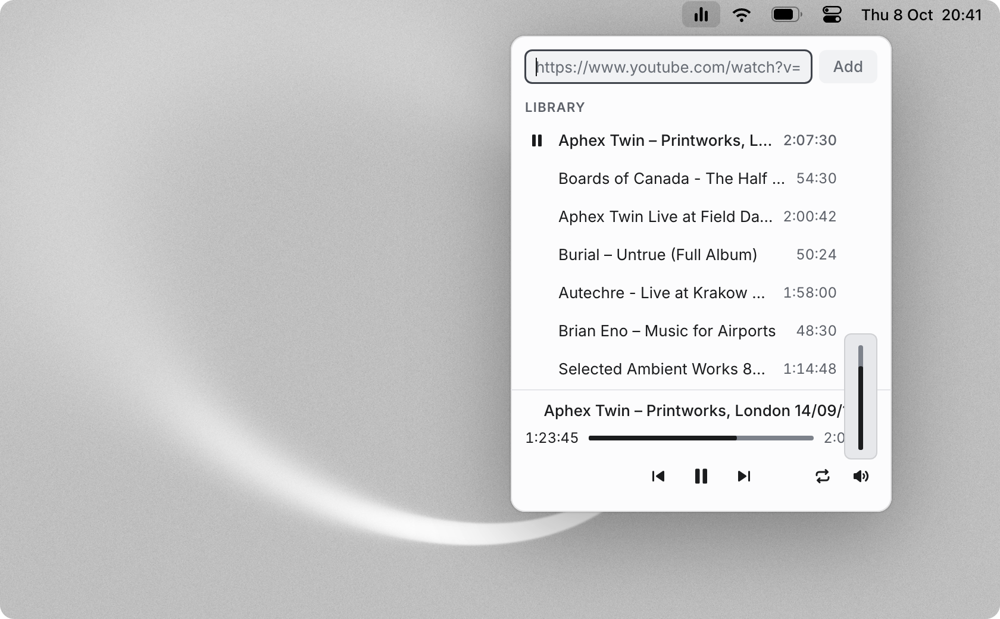

# Menubar Player

An audio player for YouTube that lives in the macOS menu bar. Paste a link, close the popover and keep working.
It remembers where you stopped in every track.


https://github.com/user-attachments/assets/7eae8b50-8037-4816-91d2-a9311b0a73d5


## Features

- **Lives in the menu bar.** No Dock icon and no window: a small popover under an icon that shows level bars
  while something plays and a pause sign when nothing does.
- **A library that remembers.** Every track keeps its position, so a three-hour podcast resumes where you left
  it, even after quitting. Removing a track can be undone.
- **Keeps playing with the popover closed**, moves on to the next track by itself and repeats the library or a
  single track.
- **Media keys**: play, pause, previous and next.
- **A menu on right click**: play or pause, skip to the next track, launch at login and quit.
- **Recovers by itself.** Stream links expire after a few hours; the app notices, asks for a new one and carries
  on from the same second.
- **Keyboard first.** Tab follows the visual order, the arrow keys move through the library, Enter plays, Space
  toggles playback and the arrows seek by 1 s (10 s with Shift) on the progress bar.
- **Dark and light**, following the system, and it respects Reduce Motion.



## Install

For Apple Silicon Macs with macOS 14 or later.

### Homebrew

```sh
brew install --cask cagndz/tap/menubar-player
```

This also installs [yt-dlp](https://github.com/yt-dlp/yt-dlp), which the app uses to find the audio of each
video.

### Download

Download the DMG from the [latest release](https://github.com/cagndz/menubar-player/releases/latest), open it
and drag the app to Applications. The app needs yt-dlp, so install it too:

```sh
brew install yt-dlp
```

### First launch

The app is not notarized by Apple, so macOS stops it the first time with "Apple could not verify Menubar Player
is free of malware". To allow it, open **System Settings › Privacy & Security**, scroll down and click **Open
Anyway**. This is only needed once.

Its icon then appears in the menu bar: click it to open the player, right click for the menu.

## Development

You need [Rust](https://rustup.rs), Node.js, [pnpm](https://pnpm.io) and yt-dlp.

```sh
pnpm install
pnpm tauri dev     # run the app
pnpm tauri build   # the app and its DMG, in src-tauri/target/release/bundle
pnpm test          # frontend tests
pnpm contrast      # every colour pairing of both themes against WCAG AA
cargo test --manifest-path src-tauri/Cargo.toml
```

`http://localhost:1420/preview.html` shows the popover in every state with sample data while the app runs in
development.

Built with Tauri 2, Rust, React, TypeScript, Tailwind CSS 4 and Motion.

## Limitations

- YouTube may ask for a sign-in check on some networks. The app reports it and backs off; it does not use
  browser cookies or any other way around it.
- Single videos only; playlist links are not expanded.
- Apple Silicon only, and not signed with an Apple developer certificate.

## Disclaimer

A personal project, not affiliated with YouTube or Google. It streams audio for playback and does not download
or save anything. Using it is subject to YouTube's Terms of Service.

## License

[MIT](LICENSE)
